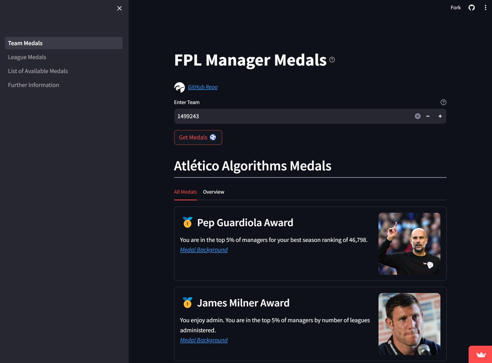

# FPL Tool | Manager Medals

### Overview
This identifies how an inputted FPL team over or under indexes across a variety of measures, and allocates medals accordingly.

### Hosted Dashboard Location
https://fpl-manager-medals.streamlit.app/

### Citation

Historical player data obtained from the following repository:
> **Title**: Fantasy-Premier-League
> 
> **Author**: Anand Vaastav
> 
> **URL**: https://github.com/vaastav/Fantasy-Premier-League


### Local Instructions
Python Version: 3.11.7

Clone this repo:
```
git clone https://github.com/edward-farragher/fpl-manager-medals.git
cd fpl-manager-medals
```

Install requirements (in virtual environment):
```
pip install -r requirements.txt
```

Run the Streamlit app:
```
streamlit run Team_Medals.py
```

Navigate to local host: http://127.0.0.1:8050/.


## Dashboard Preview


